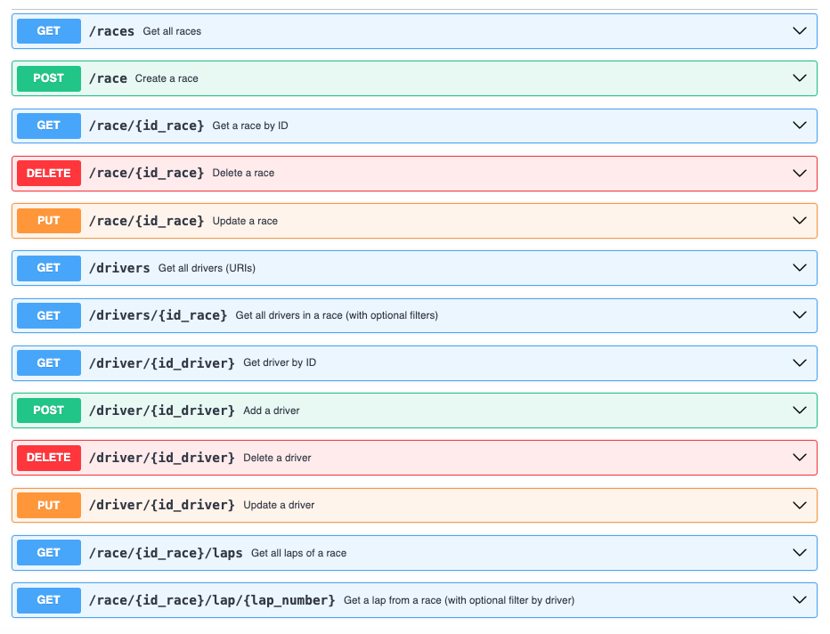

# 📌 F1 Data API  

- Pasarlo a inglés
- Meter enlace a Design

🚀 **F1 Data API** proporciona acceso a datos históricos de la Fórmula 1. Ideal para desarrolladores, analistas y entusiastas que quieran integrar estadísticas de carreras, información de pilotos, equipos y más en sus proyectos.  


## ✨ Características  
- 📊 Datos de carreras, pilotos, equipos y circuitos.  
- ⏱️ Estadísticas históricas.  
- 🔧 Endpoints RESTful fáciles de usar.  
- 📂 Compatible con múltiples formatos de salida (JSON, XML, etc.).  


## 🚀 Instalación  
```bash
git clone https://github.com/pperezdem/f1-data-api.git  
cd f1-data-api  
npm install 
```


## 🏁 Uso  
Consulta la documentación completa en [Wiki](#) o prueba los endpoints con:  
```bash
curl -X GET "https://api.f1data.com/races/2024" -H "Authorization: Bearer YOUR_API_KEY"
```

## Diseño
Puedes encontrar el diseño de la API en este enlace [Design Doc](Design/openapi-f1data.yaml).




## 👩‍💻 Desarrolladores  
Este proyecto ha sido desarrollado por:  
- [Carlos Moragón](https://github.com/carlosMoragon)  
- [Orianna Milone](https://github.com/OriannaMilone)  
- [Paloma Pérez de Madrid](https://github.com/PPerezdeMadrid)


## 📜 Licencia  
Este proyecto está bajo la licencia MIT.  

🔗 **Contribuciones bienvenidas**. ¡Haz un fork y mejora la API! 🚀  


